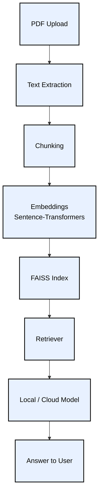

<p align="left">         </p>

# StudyMind AI

**Smart Notes → Search → Ask → Quiz**

---------------------------------------------------

# Overview

- StudyMind AI is a simple study assistant that lets you:

- Upload study PDFs

- Process notes into clean chunks

- Search topics fast

- Ask questions using a local or cloud model

- Generate small quizzes

- Everything works offline on your PC and online on Streamlit Cloud.

--------------------------------------------------------

# Flow Diagram: Full System




----------------------------------------------------


# Tech Stack

**Core**

- Streamlit

- Python

- LangChain

- FAISS

- Sentence-Transformers

- PDF Processing

- pypdf

- pdfplumber

**Models**

- Local: Ollama (Llama 3.2 3B)

- Cloud: Tiny Models (Phi-1.5)

- Utilities

- numpy

- pandas

- dotenv

- plotly

-------------------------------------------------

# Key Concepts Covered

- RAG pipeline

- Local embeddings

- Vector search using FAISS

- Note chunking

- Context retrieval

- Local + Cloud LLM switching(Streamlit)

- PDF ingestion

- Simple quiz generation

- Streamlit UI workflow

---------------------------------------------------

# Local vs Cloud Usage(Streamlit)

**Local PC**

- PDF processing works

- Embeddings work

- FAISS search works

- Local LLM through Ollama works


**Streamlit Cloud**

- PDF processing works

- Embeddings work

- FAISS search works

- Local LLM not supported

- Tiny models work

-----------------------------------------------

# Flow Diagram: Local vs Cloud Path

```mermaid
flowchart TB
    A[User Question]:::node --> B[Retrieve Context]:::node
    B --> C{Running Environment?}:::node
    C -->|Local PC| D[Ollama Model]:::node
    C -->|Streamlit Cloud| E[Tiny Model]:::node
    D --> F[Final Answer]:::node
    E --> F[Final Answer]:::node

    classDef node fill:#e8f1ff,stroke:#000,stroke-width:2px,color:#000,font-size:16px,padding:12px;
'''

---------------------------------------------------------

# Installation Instructions

**For Windows**

- Clone the repository

git clone https://github.com/yourusername/StudyMind-AI.git

cd StudyMind-AI

- Create virtual environment

python -m venv venv

- Activate virtual environment

venv\Scripts\activate

- Install dependencies

pip install --upgrade pip

pip install -r requirements.txt

- Install Ollama (for local LLM)

Download from: **https://ollama.com/download/windows**

Run the installer (typical Windows installation)

- Pull a model (in new PowerShell window, not in venv)

ollama pull llama3.2:3b

- Run the app

streamlit run app.py

-----------------------------

**For Mac and Linux**

- Clone the repository

git clone https://github.com/yourusername/StudyMind-AI.git

cd StudyMind-AI

- Create virtual environment

python3 -m venv venv

- Activate virtual environment

source venv/bin/activate

- Install dependencies

pip install --upgrade pip

pip install -r requirements.txt

- Install Ollama

curl -fsSL https://ollama.com/install.sh | sh

- Pull Llama model

ollama pull llama3.2:3b

- Launch application

streamlit run app.py

--------------------------------------------------------
--------------------------------------------------------

# AI and ML Flow


```mermaid
flowchart TD
    A[Data Ingestion]:::ingest --> B[Data Preprocessing]:::preprocess
    B --> C[Feature Engineering]:::feature
    C --> D[Model Training / Setup]:::train
    D --> E[Model Evaluation / Retrieval]:::eval
    E --> F[Deployment]:::deploy
    F --> G[Monitoring & Optimization]:::monitor

    %% Details inside each stage
    A --> A1[Upload PDFs & Extract Text (pypdf + pdfplumber)]
    A --> A2[Clean & Structure Raw Data]
    A --> A3[Metadata Preservation (chapter, page numbers)]

    B --> B1[Text Chunking with Overlap (LangChain)]
    B --> B2[Clean / Filter for Meaningful Context]

    C --> C1[Generate Embeddings (Sentence-Transformers)]
    C --> C2[Store Embeddings in FAISS]
    C --> C3[Metadata Tagging for Retrieval]

    D --> D1[Local LLM: Ollama]
    D --> D2[Cloud Fallback: Tiny Models (Phi-1.5)]
    D --> D3[No Explicit Training Required]

    E --> E1[Retrieve Relevant Chunks via Vector Search]
    E --> E2[Evaluate Answers from LLM]
    E --> E3[Quiz Generation for Testing]

    F --> F1[Local PC: Full RAG System]
    F --> F2[Streamlit Cloud: Tiny Models & Optimized]
    F --> F3[Streamlit UI with Multi-Page Workflow]

    G --> G1[Parallel Processing for Speed]
    G --> G2[Memory-Efficient Embedding Caching]
    G --> G3[Fallback Mechanisms if Local LLM Unavailable]
    G --> G4[Error Handling & User-Friendly Messages]

    %% Coloring
    classDef ingest fill:#ffcccc,stroke:#000,stroke-width:1px,color:#000,font-size:16px,padding:6px;
    classDef preprocess fill:#ffe0b3,stroke:#000,stroke-width:1px,color:#000,font-size:16px,padding:6px;
    classDef feature fill:#ffff99,stroke:#000,stroke-width:1px,color:#000,font-size:16px,padding:6px;
    classDef train fill:#ccffcc,stroke:#000,stroke-width:1px,color:#000,font-size:16px,padding:6px;
    classDef eval fill:#99ccff,stroke:#000,stroke-width:1px,color:#000,font-size:16px,padding:6px;
    classDef deploy fill:#d9b3ff,stroke:#000,stroke-width:1px,color:#000,font-size:16px,padding:6px;
    classDef monitor fill:#ffb3b3,stroke:#000,stroke-width:1px,color:#000,font-size:16px,padding:6px;
'''


