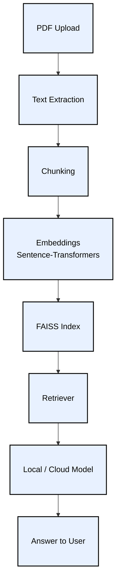
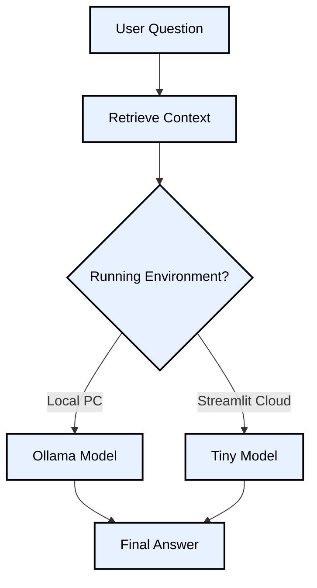

<p align="left">         </p>

# StudyMind AI

**Smart Notes → Search → Ask → Quiz**

---------------------------------------------------

# Overview

- StudyMind AI is a simple study assistant that lets you:

- Upload study PDFs

- Process notes into clean chunks

- Search topics fast

- Ask questions using a local or cloud model

- Generate small quizzes

- Everything works offline on your PC and online on Streamlit Cloud.

--------------------------------------------------------

# Flow Diagram: Full System




----------------------------------------------------


# Tech Stack

**Core**

- Streamlit

- Python

- LangChain

- FAISS

- Sentence-Transformers

- PDF Processing

- pypdf

- pdfplumber

**Models**

- Local: Ollama (Llama 3.2 3B)

- Cloud: Tiny Models (Phi-1.5)

- Utilities

- numpy

- pandas

- dotenv

- plotly

-------------------------------------------------

# Key Concepts Covered

- RAG pipeline

- Local embeddings

- Vector search using FAISS

- Note chunking

- Context retrieval

- Local + Cloud LLM switching(Streamlit)

- PDF ingestion

- Simple quiz generation

- Streamlit UI workflow

---------------------------------------------------

# Local vs Cloud Usage(Streamlit)

**Local PC**

- PDF processing works

- Embeddings work

- FAISS search works

- Local LLM through Ollama works


**Streamlit Cloud**

- PDF processing works

- Embeddings work

- FAISS search works

- Local LLM not supported

- Tiny models work

-----------------------------------------------

# Flow Diagram: Local vs Cloud Path



---------------------------------------------------------

# Installation Instructions

**For Windows**

- Clone the repository

git clone https://github.com/yourusername/StudyMind-AI.git

cd StudyMind-AI

- Create virtual environment

python -m venv venv

- Activate virtual environment

venv\Scripts\activate

- Install dependencies

pip install --upgrade pip

pip install -r requirements.txt

- Install Ollama (for local LLM)

Download from: **https://ollama.com/download/windows**

Run the installer (typical Windows installation)

- Pull a model (in new PowerShell window, not in venv)

ollama pull llama3.2:3b

- Run the app

streamlit run app.py

-----------------------------

**For Mac and Linux**

- Clone the repository

git clone https://github.com/yourusername/StudyMind-AI.git

cd StudyMind-AI

- Create virtual environment

python3 -m venv venv

- Activate virtual environment

source venv/bin/activate

- Install dependencies

pip install --upgrade pip

pip install -r requirements.txt

- Install Ollama

curl -fsSL https://ollama.com/install.sh | sh

- Pull Llama model

ollama pull llama3.2:3b

- Launch application

streamlit run app.py

--------------------------------------------------------
--------------------------------------------------------

# AI and ML Cycle

```mermaid
flowchart TD
    A[Data Ingestion]:::ingest --> B[Data Preprocessing]:::preprocess
    B --> C[Feature Engineering]:::feature
    C --> D[Model Training / Setup]:::train
    D --> E[Model Evaluation / Retrieval]:::evaluate
    E --> F[Deployment]:::deploy
    F --> G[Monitoring & Optimization]:::monitor

    classDef ingest fill:#ffdfba,stroke:#333,stroke-width:2px,color:#000,font-size:16px,padding:10px;
    classDef preprocess fill:#ffd6d6,stroke:#333,stroke-width:2px,color:#000,font-size:16px,padding:10px;
    classDef feature fill:#caffbf,stroke:#333,stroke-width:2px,color:#000,font-size:16px,padding:10px;
    classDef train fill:#9bf6ff,stroke:#333,stroke-width:2px,color:#000,font-size:16px,padding:10px;
    classDef evaluate fill:#bdb2ff,stroke:#333,stroke-width:2px,color:#000,font-size:16px,padding:10px;
    classDef deploy fill:#ffc6ff,stroke:#333,stroke-width:2px,color:#000,font-size:16px,padding:10px;
    classDef monitor fill:#ffffba,stroke:#333,stroke-width:2px,color:#000,font-size:16px,padding:10px;

    %% Detailed steps as subnotes
    A --> A1[Upload PDFs & extract text]
    A --> A2[Clean & structure data]
    A --> A3[Preserve metadata]

    B --> B1[Chunk text with overlap]
    B --> B2[Filter & clean context]

    C --> C1[Generate embeddings (Sentence-Transformers)]
    C --> C2[Store in FAISS vector DB]
    C --> C3[Tag metadata for retrieval]

    D --> D1[Local LLM: Ollama]
    D --> D2[Cloud fallback: Tiny Models]
    
    E --> E1[Retrieve relevant chunks]
    E --> E2[Evaluate answer quality]
    E --> E3[Quiz generation]

    F --> F1[Local PC: Full RAG system]
    F --> F2[Streamlit Cloud: Tiny Models]
    F --> F3[Streamlit UI workflow]

    G --> G1[Parallel processing for speed]
    G --> G2[Memory-efficient caching]
    G --> G3[Fallback & error handling]
```

---------------------------------------------------------------------------
---------------------------------------------------------------------------


